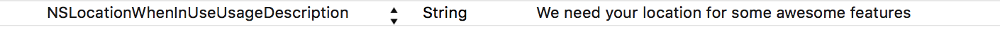

<p align="center">

</p>
# STLocationRequest

[](https://developer.apple.com/swift/)
[](http://cocoapods.org/pods/STLocationRequest)
[](http://cocoapods.org/pods/STLocationRequest)
[](http://cocoapods.org/pods/STLocationRequest)
[](https://codebeat.co/projects/github-com-sventiigi-stlocationrequest)

STLocationRequest is a UIViewController-Extension which is used to request the User-Location, at the very first time, in a simple and elegent way written in Swift. It shows a beautiful 3D 360 degree Flyover-MapView which shows 16 random citys or landmarks.

<p align="center">


</p>

## Installation

STLocationRequest is available through [CocoaPods](http://cocoapods.org). To install
it, simply add the following line to your Podfile:

```ruby
pod 'STLocationRequest'
```

## Usage

To show the `STLocationRequest`-Controller simply call 

```swift
import STLocationRequest

func showLocationRequest(){
    self.showLocationRequestController(
						setTitle: "We need your location for some awesome features",
						setAllowButtonTitle: "Alright",
						setNotNowButtonTitle: "Not now",
						setMapViewAlphaValue: 0.9,
						setBackgroundViewColor: UIColor.lightGrayColor(),
						setDelegate: self)
}

```

or you can use the alternative way by initializing an `STLocationRequest`-Object.

```swift
import STLocationRequest

func showLocationRequest(){
    let locationRequest = STLocationRequest(viewController: self)
    locationRequest.titleText = "We need your location for some awesome features"
    locationRequest.allowButtonTitle = "Alright"
    locationRequest.notNowButtonTitle = "Not now"
    locationRequest.mapViewAlphaValue = 0.9
    locationRequest.backgroundViewColor = UIColor.lightGrayColor()
    locationRequest.delegate = self
    locationRequest.presentLocationRequestController()
}

```

## Appearance

To match with your design of your app, simply playaround with the parameters `setMapViewAlphaValue` and `setBackgroundViewColor` to get your very own design.

<p align="center">


</p>

## LocationRequestDelegate

Also you can apply to the `LocationRequestDelegate` to get notified if the user has authorized, denied the Location Services, tapped the _Not-Now_ Button or if the `STLocationRequestController` is presented.

```swift

func locationRequestNotNow(){
    print("The user canceled the locationRequestScreen")
}

func locationRequestAuthorized(){
    print("Location service is allowed by the user. You have now access to the user location")
}

func locationRequestDenied(){
    print("Location service are denied by the user")
}

func locationRequestControllerPresented() {
    print("STLocationRequestController presented")
}

```

## Location Usage Description

Also don't forget to add the `NSLocationWhenInUseUsageDescription` key to your `Info.plist`

```swift
<key>NSLocationWhenInUseUsageDescription</key>
<string>PUT IN YOUR LOCATION EXPLANATION TEXT</string>
```

This text will show in the standard iOS Location-Request-Dialog which will show up, when the user tapped the allow button

For more details check out the example application.

## 3D Flyover-View in Simulator

Please mind that the 3D Flyover-View will only work on a real iOS device (not in the Simulator) with at least iOS 9.0 installed. A 2D fallback for Simulator or iOS 8.0 devices is already integrated.

## Objective-C

To show the `STLocationRequest`-Controller in an `Objective-C` project you can do it like so.

```objective-c
#import "ViewController.h"
@import STLocationRequest;

@interface ViewController () <LocationRequestDelegate>

@end

@implementation ViewController

-(void)showLocationRequestController{
    STLocationRequest *locationRequest = [[STLocationRequest alloc] initWithViewController:self];
    locationRequest.titleText = @"We need your location for some awesome features";
    locationRequest.allowButtonTitle = @"Alright";
    locationRequest.notNowButtonTitle = @"Not now";
    locationRequest.mapViewAlphaValue = 0.9;
    locationRequest.backgroundViewColor = [UIColor lightGrayColor];
    locationRequest.delegate = self;
    [locationRequest presentLocationRequestController];
}

```

## Author

Sven Tiigi (http://sven.tiigi.de)

## License

```
STLocationRequest
Copyright (c) 2015 Sven Tiigi <sven@tiigi.de>

Permission is hereby granted, free of charge, to any person obtaining a copy
of this software and associated documentation files (the "Software"), to deal
in the Software without restriction, including without limitation the rights
to use, copy, modify, merge, publish, distribute, sublicense, and/or sell
copies of the Software, and to permit persons to whom the Software is
furnished to do so, subject to the following conditions:

The above copyright notice and this permission notice shall be included in
all copies or substantial portions of the Software.

THE SOFTWARE IS PROVIDED "AS IS", WITHOUT WARRANTY OF ANY KIND, EXPRESS OR
IMPLIED, INCLUDING BUT NOT LIMITED TO THE WARRANTIES OF MERCHANTABILITY,
FITNESS FOR A PARTICULAR PURPOSE AND NONINFRINGEMENT. IN NO EVENT SHALL THE
AUTHORS OR COPYRIGHT HOLDERS BE LIABLE FOR ANY CLAIM, DAMAGES OR OTHER
LIABILITY, WHETHER IN AN ACTION OF CONTRACT, TORT OR OTHERWISE, ARISING FROM,
OUT OF OR IN CONNECTION WITH THE SOFTWARE OR THE USE OR OTHER DEALINGS IN
THE SOFTWARE.
```
