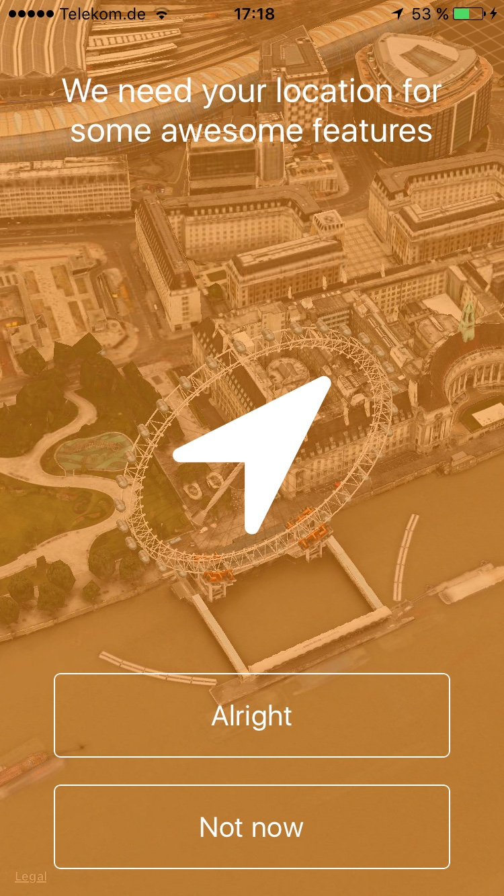
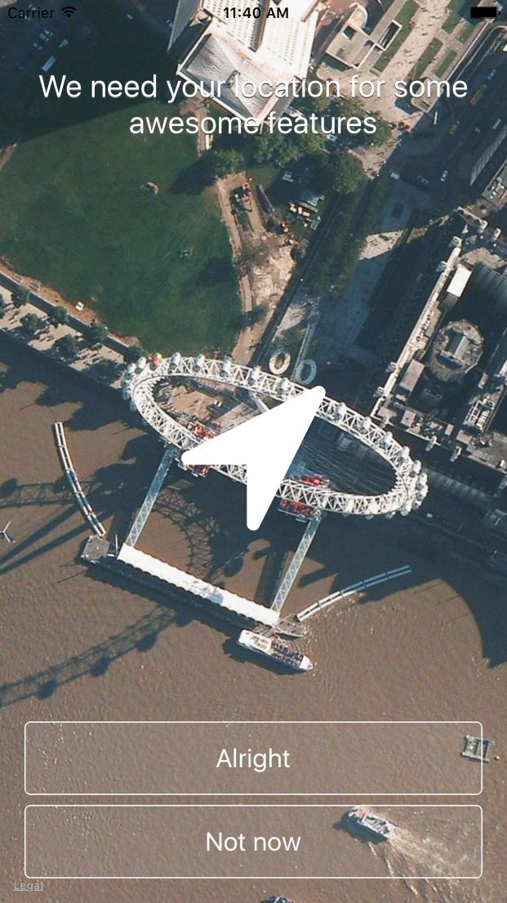

<p align="center">

</p>

# STLocationRequest

[](https://developer.apple.com/swift/)
[](http://cocoapods.org/pods/STLocationRequest)
[](http://cocoapods.org/pods/STLocationRequest)
[](http://cocoapods.org/pods/STLocationRequest)

STLocationRequest is a simple and elegant way to request the user location at the very first time written in Swift. It shows a beautiful 3D 360 degree Flyover-MapView over 20 citys or landmarks.

<p align="center">
<br>


</p>

## Installation

STLocationRequest is available through [CocoaPods](http://cocoapods.org). To install
it, simply add the following line to your Podfile:

```ruby
pod 'STLocationRequest'
```

## Usage

```swift
import STLocationRequest

class ViewController: UIViewController, STLocationRequestControllerDelegate {

    func presentLocationRequestController(){
        let locationRequestController = STLocationRequestController.getInstance()
        locationRequestController.titleText = "We need your location for some awesome features"
        locationRequestController.allowButtonTitle = "Alright"
        locationRequestController.notNowButtonTitle = "Not now"
        locationRequestController.authorizeType = .requestWhenInUseAuthorization
        locationRequestController.delegate = self
        locationRequestController.present(onViewController: self)
    }
    
}

```
> Please keep in mind that the 3D-SatelliteFlyover only works on a real iOS Device ([Read more](#ios-simulator)).

## Customizing

To perfectly match the design to your app, simply playaround with the parameters `mapViewAlpha` and `backgroundColor` to get your very own design.

#### MapView alpha value
```swift
locationRequestController.mapViewAlpha = 0.7
```
> The alpha value for the MapView

#### BackgroundColor
```swift
locationRequestController.backgroundColor = UIColor.orange
```
> The backgroundcolor for the view of the STLocationRequestController

<p align="center">




</p>

#### TitleText
```swift
locationRequestController.titleText = "We need your location for some extraordinary features"
```
> The title which will be presented at the top of the STLocationRequestController. Default-Value: "We need your location for some awesome features"

#### TitleFont
```swift
locationRequestController.titleFont = UIFont.systemFont(ofSize: 14.0)
```
> The title which will be presented at the top of the STLocationRequestController. Default-Value: UIFont.systemFontOfSize(25.0)

#### AllowButtonTitle
```swift
locationRequestController.allowButtonTitle = "Yes of course"
```
> The title for the allowButton which will trigger the requestWhenInUseAuthorization() or requestAlwaysAuthorization() Method on CLLocationManager. Default value is "Alright"

#### NotNowButtonTitle
```swift
locationRequestController.notNowButtonTitle = "Nope"
```
> The title for the notNowButton which will dismiss the STLocationRequestController. Default value is "Not now"

#### Location-Request Authorization-Type
```swift
locationRequestController.authorizeType = .requestWhenInUseAuthorization
```
> Set the location request authorize Type for STLocationRequestController. Choose between: .requestWhenInUseAuthorization and .requestAlwaysAuthorization. Default value is .requestWhenInUseAuthorization

#### isPulseEffectEnabled
```swift
locationRequestController.isPulseEffectEnabled = true
```
> Defines if the pulse Effect which will displayed under the location symbol should be enabled or disabled. Default Value: true

#### PulseEffectColor
```swift
locationRequestController.pulseEffectColor = UIColor.white
```
> The color for the pulse effect behind the location symbol. Default value: white

#### LocationSymbolIcon
```swift
locationRequestController.locationSymbolIcon = FAType.FALocationArrow
```
> Set the location symbol icon which will be displayed in the middle of the STLocationRequest-Controller. The devault value is FALocationArrow. You can browse at http://fontawesome.io/icons/ or https://github.com/Vaberer/Font-Awesome-Swift for other icons but be aware to use a icon which is in the context of a location request.

#### LocationSymbolColor
```swift
locationRequestController.locationSymbolColor = UIColor.white
```
> The color of the location symbol which will be presented in the middle of the location request screen. Default value: white

#### isLocationSymbolHidden
```swift
locationRequestController.isLocationSymbolHidden = false
```
> Defines if the location symbol which will be presented in the middle of the location request screen is hidden. Default value: false

#### TimeTillPlaceSwitchesInSeconds
```swift
locationRequestController.timeTillPlaceSwitchesInSeconds = 15.0
```
> Set the in the interval for switching the shown places in seconds. Default value is 15 seconds

#### PlacesFilter
```swift
// Only San Francisco Golden Gate Bridge and the Colosseum in Rome will be shown
locationRequestController.placesFilter = [.sanFranciscoGoldenGateBridge, .romeColosseum]
```
> Fill the optional value placesFilter if you wish to specify which places should be shown. Default value is "nil" which means all places will be shown

## Delegate

You can apply to the `STLocationRequestControllerDelegate` to get notified if the user has authorized or denied the location services, tapped the _Not-Now_ Button or if the `STLocationRequestController` did presented or did disappear.

```swift

func locationRequestControllerDidChange(event: STLocationRequestControllerEvent) {
    switch event {
        case .locationRequestAuthorized:
            break
        case .locationRequestDenied:
            break
        case .notNowButtonTapped:
            break
        case .didPresented:
            break
        case .didDisappear:
            break
    }
}

```

## Info.plist

Also don't forget to add the usage description key to your `Info.plist` for you selected authorization type.

STLocationRequestControllerAuthorizeType.**requestWhenInUseAuthorization**
```swift
<key>NSLocationWhenInUseUsageDescription</key>
<string>PUT IN YOUR LOCATION EXPLANATION TEXT</string>
```

STLocationRequestControllerAuthorizeType.**requestAlwaysAuthorization**
```swift
<key>NSLocationAlwaysUsageDescription</key>
<string>PUT IN YOUR LOCATION EXPLANATION TEXT</string>
```

This text will be shown in the default iOS location request dialog, which will show up when the user tapped the allow button.

<p align="center">


</p>

For more details check out the example application.

## Presenting-Recommendation

The recommended way to present `STLocationRequestController` is the following way, which is also been implemented in the example application.

```swift
@IBAction func requestLocationButtonTouched(_ sender: UIButton) {
    if CLLocationManager.locationServicesEnabled() {
        if CLLocationManager.authorizationStatus() == .denied {
            // Location Services are denied
        } else {
            if CLLocationManager.authorizationStatus() == .notDetermined{
                // Present the STLocationRequestController
                self.presentLocationRequestController()
            } else {
                // The user has already allowed your app to use location services. Start updating location
            }
        }
    } else {
        // Location Services are disabled
    }
}
```

## iOS Simulator

Please mind that the 3D Flyover-View will only work on a real iOS device (not in the Simulator) with at least iOS 9.0 installed ([Apple Developer API Reference](https://developer.apple.com/reference/mapkit/mkmaptype/1452553-satelliteflyover)). A Screenshot taken from an **iOS Simulator** running `STLocationRequestController`.

<p align="center">


</p>

## Objective-C

An example usage of `STLocationRequestController` in an `Objective-C` project.

```objective-c
#import "ViewController.h"
@import STLocationRequest;

@interface ViewController () <STLocationRequestControllerDelegate>
@end

@implementation ViewController

-(void)presentLocationRequestController{
    STLocationRequestController *locationRequestController = [STLocationRequestController getInstance];
    locationRequestController.titleText = @"We need your location for some awesome features";
    locationRequestController.allowButtonTitle = @"Alright";
    locationRequestController.notNowButtonTitle = @"Not now";
    locationRequestController.mapViewAlpha = 0.9;
    locationRequestController.backgroundColor = [UIColor lightGrayColor];
    locationRequestController.authorizeType = STLocationRequestControllerAuthorizeTypeRequestWhenInUseAuthorization;
    locationRequestController.delegate = self;
    [locationRequestController presentOnViewController:self];
}

-(void)locationRequestControllerDidChange:(enum STLocationRequestControllerEvent)event{
    switch (event) {
        case STLocationRequestControllerEventlocationRequestAuthorized:
            break;
        case STLocationRequestControllerEventlocationRequestDenied:
            break;
        case STLocationRequestControllerEventnotNowButtonTapped:
            break;
        case STLocationRequestControllerEventdidPresented:
            break;
        case STLocationRequestControllerEventdidDisappear:
            break;
    }
}

```
## Credits
`STLocationRequest` is using following libraries.

+ [Font-Awesome-Swift](https://github.com/Vaberer/Font-Awesome-Swift)
+ [SwiftPulse](https://github.com/ctews/SwiftPulse)

## Author

<p align="center">
<br><br>
Sven Tiigi<br>
http://sven.tiigi.de
</p>

## License

```
STLocationRequest
Copyright (c) 2015 Sven Tiigi <sven@tiigi.de>

Permission is hereby granted, free of charge, to any person obtaining a copy
of this software and associated documentation files (the "Software"), to deal
in the Software without restriction, including without limitation the rights
to use, copy, modify, merge, publish, distribute, sublicense, and/or sell
copies of the Software, and to permit persons to whom the Software is
furnished to do so, subject to the following conditions:

The above copyright notice and this permission notice shall be included in
all copies or substantial portions of the Software.

THE SOFTWARE IS PROVIDED "AS IS", WITHOUT WARRANTY OF ANY KIND, EXPRESS OR
IMPLIED, INCLUDING BUT NOT LIMITED TO THE WARRANTIES OF MERCHANTABILITY,
FITNESS FOR A PARTICULAR PURPOSE AND NONINFRINGEMENT. IN NO EVENT SHALL THE
AUTHORS OR COPYRIGHT HOLDERS BE LIABLE FOR ANY CLAIM, DAMAGES OR OTHER
LIABILITY, WHETHER IN AN ACTION OF CONTRACT, TORT OR OTHERWISE, ARISING FROM,
OUT OF OR IN CONNECTION WITH THE SOFTWARE OR THE USE OR OTHER DEALINGS IN
THE SOFTWARE.
```
